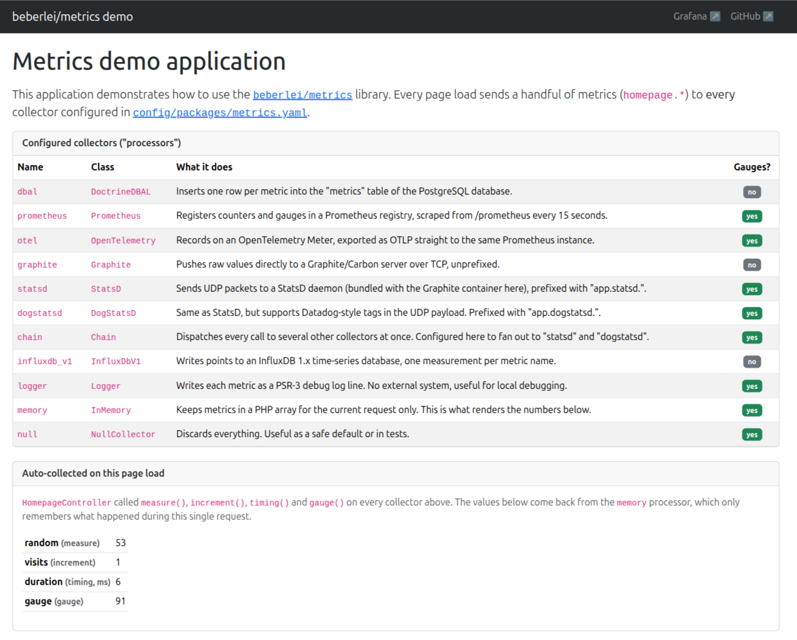

# Metrics

Simple library that abstracts different metrics collectors. I find this
necessary to have a consistent and simple metrics API that doesn't cause vendor
lock-in.

It also ships with a Symfony Bundle. **This is not a library for displaying metrics.**

> [!IMPORTANT]
> Upgrading from 2.x? Read the
> [UPGRADE guide](UPGRADE.md) first: it documents every breaking change and how
> to migrate your code.

A full [demo application](examples/README.md) is available, with a Docker
stack provisioning Grafana dashboards for every collector:

[](examples/README.md)

Currently supported backends:

* Chain (Dispatches to a list of other collectors)
* CloudWatch
* Doctrine DBAL
* DogStatsD
* Graphite
* InfluxDb (version 1)
* InfluxDb (version 2+)
* Logger (Psr\Log\LoggerInterface)
* Null (Dummy that does nothing)
* OpenTelemetry
* Prometheus
* StatsD
* Telegraf

## Installation

Using Composer:

```
composer require beberlei/metrics
```

## API

You can instantiate clients:

```php
$collector = \Beberlei\Metrics\Factory::create('statsd');
```

You can measure stats:

```php
$collector->increment('foo.bar');
$collector->decrement('foo.bar');

$start = microtime(true);
$diff  = microtime(true) - $start;
$collector->timing('foo.bar', $diff);

$value = 1234;
$collector->measure('foo.bar', $value);
```

All backends defer sending and aggregate all information, make sure to call
flush:

```php
$collector->flush();
```

### Sending metrics to several backends at once

The `Chain` collector dispatches every call to a list of other collectors. It
is useful when you want to send the same metrics to several backends, for
example StatsD and a logger:

```php
$collector = new \Beberlei\Metrics\Collector\Chain(
    \Beberlei\Metrics\Factory::create('statsd'),
    \Beberlei\Metrics\Factory::create('logger', ['logger' => $logger]),
);

$collector->increment('foo.bar');
$collector->flush();
```

It also implements `GaugeableCollectorInterface`: `gauge()` calls are only
forwarded to the chained collectors that support gauges, the others are
silently skipped.

### Sending metrics through OpenTelemetry

The `OpenTelemetry` collector records measurements on an
[OpenTelemetry](https://opentelemetry.io/docs/languages/php/) `MeterProvider`.
It requires the `open-telemetry/api` package, and an actual SDK (such as
`open-telemetry/sdk` together with an exporter) to do anything useful with the
recorded data:

```
composer require open-telemetry/api open-telemetry/sdk open-telemetry/exporter-otlp
```

```php
$collector = new \Beberlei\Metrics\Collector\OpenTelemetry(
    $meterProvider, // an OpenTelemetry\API\Metrics\MeterProviderInterface
    'my_app', // instrumentation scope name, defaults to "beberlei/metrics"
    ['dc' => 'west'], // default attributes merged into every data point
);

$collector->increment('foo.bar');
$collector->flush();
```

It can also be created through the `Factory`:

```php
$collector = \Beberlei\Metrics\Factory::create('opentelemetry', [
    'meter_provider' => $meterProvider,
    'name' => 'my_app', // optional, defaults to "beberlei/metrics"
    'tags' => ['dc' => 'west'], // optional
]);
```

Calls are recorded immediately on the underlying OpenTelemetry instruments,
as the API is meant to be used, instead of being buffered like the other
collectors. `flush()` only calls `forceFlush()` on the `MeterProvider`, so
that anything still buffered by the SDK's own exporters is sent before a
short-lived PHP process ends; it is a no-op if the provider does not support
it (for example the API's `NoopMeterProvider`).

Like every other collector, it never lets an error or exception raised by the
underlying provider/instruments (or by a non-stringable tag value) reach the
instrumented application: those calls are silently ignored.

Each method maps to the OpenTelemetry instrument that matches its semantics
the closest:

* `measure()`/`increment()`/`decrement()` use an `UpDownCounter`, since a
  `Counter` is monotonic and cannot go down or receive a negative amount
* `timing()` uses a `Histogram`, with a `ms` unit
* `gauge()` uses a `Gauge`, tracking relative `+`/`-` adjustments locally
  before recording the resulting absolute value, like the other collectors

### Sending metrics to InfluxDB (version 2+)

The `InfluxDbV2` collector writes points to an
[InfluxDB 2.x/3.x](https://www.influxdata.com/) bucket through the official
`influxdata/influxdb-client-php` client. It requires an `InfluxDB2\WriteApi`,
created from an `InfluxDB2\Client`:

```
composer require influxdata/influxdb-client-php
```

```php
$client = new \InfluxDB2\Client([
    'url' => 'http://localhost:8086',
    'token' => 'my-token',
    'org' => 'my-org',
    'bucket' => 'my-bucket',
]);

$collector = new \Beberlei\Metrics\Collector\InfluxDbV2(
    $client->createWriteApi(),
    ['dc' => 'west'], // default tags merged into every point
);

$collector->increment('foo.bar');
$collector->flush();
```

It can also be created through the `Factory`:

```php
$collector = \Beberlei\Metrics\Factory::create('influxdb_v2', [
    'write_api' => $client->createWriteApi(),
    'tags' => ['dc' => 'west'], // optional
]);
```

Every metric is written as one field, named `value`, on a point whose
measurement is the metric name. `InfluxDB 3.x` servers accept the same v2
write API in compatibility mode, so this collector works against both.

### Sending metrics to AWS CloudWatch

The `CloudWatch` collector publishes metric data points through
[Amazon CloudWatch](https://aws.amazon.com/cloudwatch/)'s `PutMetricData` API,
using the official AWS SDK for PHP. It requires an `Aws\CloudWatch\CloudWatchClient`:

```
composer require aws/aws-sdk-php
```

```php
$client = new \Aws\CloudWatch\CloudWatchClient([
    'region' => 'us-east-1',
    'version' => 'latest',
]);

$collector = new \Beberlei\Metrics\Collector\CloudWatch(
    $client,
    'my_app', // CloudWatch namespace, defaults to "beberlei/metrics"
    ['dc' => 'west'], // default tags, turned into CloudWatch dimensions
);

$collector->increment('foo.bar');
$collector->flush();
```

It can also be created through the `Factory`:

```php
$collector = \Beberlei\Metrics\Factory::create('cloudwatch', [
    'client' => $client,
    'namespace' => 'my_app', // optional, defaults to "beberlei/metrics"
    'tags' => ['dc' => 'west'], // optional
]);
```

Credentials and region are resolved by the AWS SDK itself (environment
variables, an IAM role, a shared config file, an explicit `credentials`
option on the client, ...), the collector does not handle them. `measure()`
and `increment()`/`decrement()` use the `Count` unit, `timing()` uses
`Milliseconds`.

## Configuration

```php

$null = \Beberlei\Metrics\Factory::create('null');
```

## Symfony Bundle Integration

Register Bundle in bundles.php

```php
// config/bundles.php

return [
    // ...
    Beberlei\Bundle\MetricsBundle\BeberleiMetricsBundle::class => ['all' => true],
];

```

Do some configuration:

```yaml
# app/config/config.yml
beberlei_metrics:
    default: statsd
    collectors:
        influxdb:
            type: influxdb_v1
            database: metrics
            # host: localhost # option
            # username: username # optional
            # password: password # optional
            # port: 8086 # optional
            # If you want to use a custom database service
            # It must be an instance of "InfluxDB\Database"
            # In this case, you can omit de "database" option
            # service: my.service.id
            tags: # optional
                dc: "west"
                node_instance: "hermes10"
        influxdb2:
            type: influxdb_v2
            token: my-token
            org: my-org
            bucket: metrics
            # host: localhost # default
            # port: 8086 # default
            # protocol: http # default
            # If you want to use a custom write API service
            # It must be an instance of "InfluxDB2\WriteApi"
            # In this case, you can omit the "token"/"org"/"bucket" options
            # service: my.service.id
            tags: # optional
                dc: "west"
                node_instance: "hermes10"
        cloudwatch:
            type: cloudwatch
            region: us-east-1
            namespace: app_name # optional, defaults to "beberlei/metrics"
            # If you want to use a custom client service
            # It must be an instance of "Aws\CloudWatch\CloudWatchClient"
            # In this case, you can omit the "region" option
            # service: my.service.id
            tags: # optional
                dc: "west"
                node_instance: "hermes10"
        otel:
            type: opentelemetry
            # The service must be an instance of
            # "OpenTelemetry\API\Metrics\MeterProviderInterface"
            service: my.meter_provider.service.id
            namespace: app_name # optional, instrumentation scope name, defaults to "beberlei/metrics"
            tags: # optional
                dc: "west"
                node_instance: "hermes10"
        prometheus:
            type: prometheus
            # If you want to use a custom registry service
            # It must be an instance of "Prometheus\CollectorRegistry"
            # By default it uses an "Prometheus\Storage\InMemory" adapter
            # service: my.service.id
            namespace: app_name # optional
            tags: # optional
                dc: "west"
                node_instance: "hermes10"
        statsd:
            type: statsd
            # host: localhost # default
            # port: 8125 # default
            # prefix: '' # default
        dogstatsd:
            type: dogstatsd
            # host: localhost # default
            # port: 8125 # default
            # prefix: '' # default
        dbal:
            type: doctrine_dbal
            # Use another connection, by default it uses the default connection
            # connection: metrics
        monolog:
            type: logger
        both:
            type: chain
            # The names of the collectors to dispatch every call to
            collectors: [statsd, monolog]
```

Then, you can inject the `Beberlei\Metrics\Collector\CollectorInterface` and
start using it:

```php
use Beberlei\Metrics\Collector\CollectorInterface;

final readonly class MyService
{

    public function __construct(
        private CollectorInterface $collector,
    ) {
    }

    public function doSomething(): void
    {
        $this->collector->increment('foo.bar');
    }
}
```

The `Beberlei\Metrics\Collector\CollectorInterface` is automatically aliased to
the default collector.

If you want to inject a specific collector, you must use the `#[Target]` attribute:
```php
public function __construct(
    #[Target('name_of_the_collector')]
    CollectorInterface $memoryCollector,
) {
```
