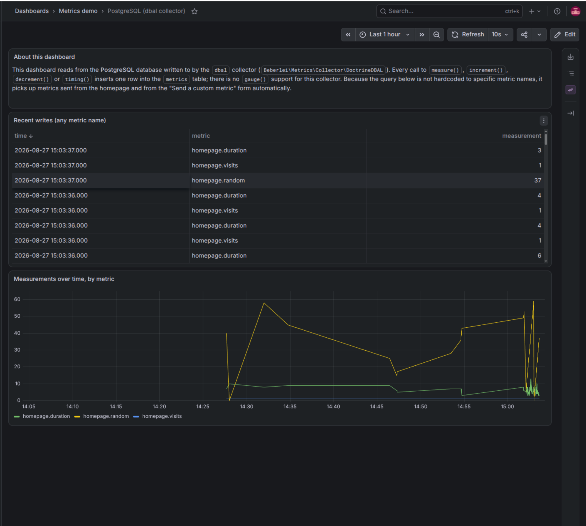
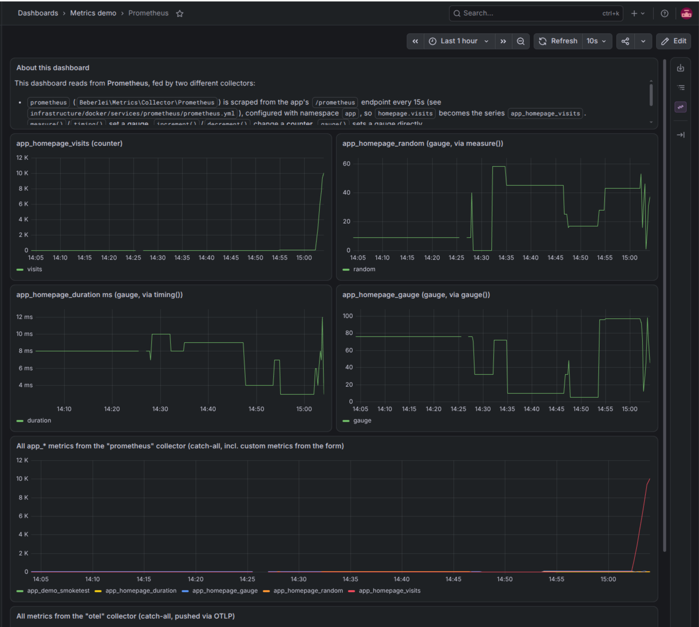
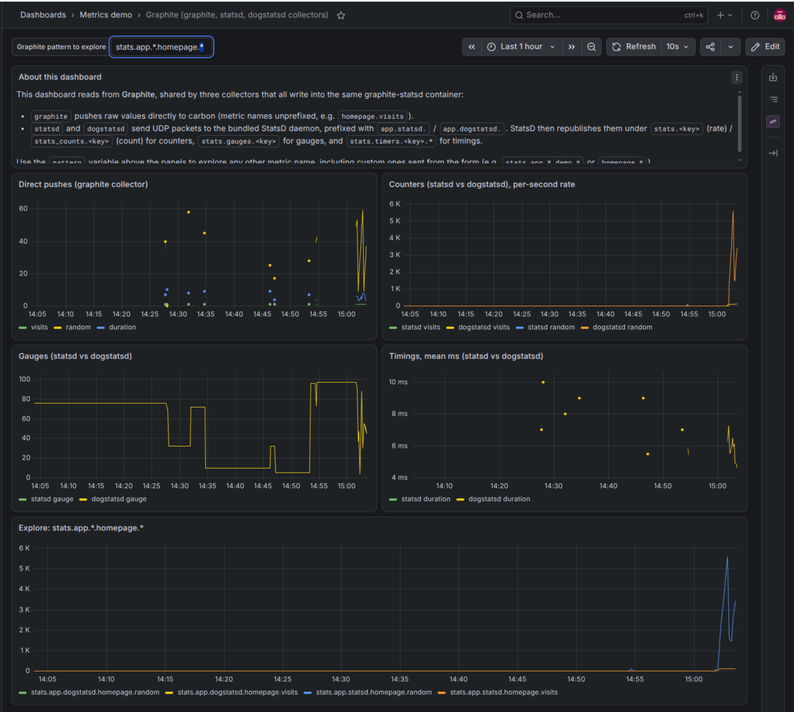
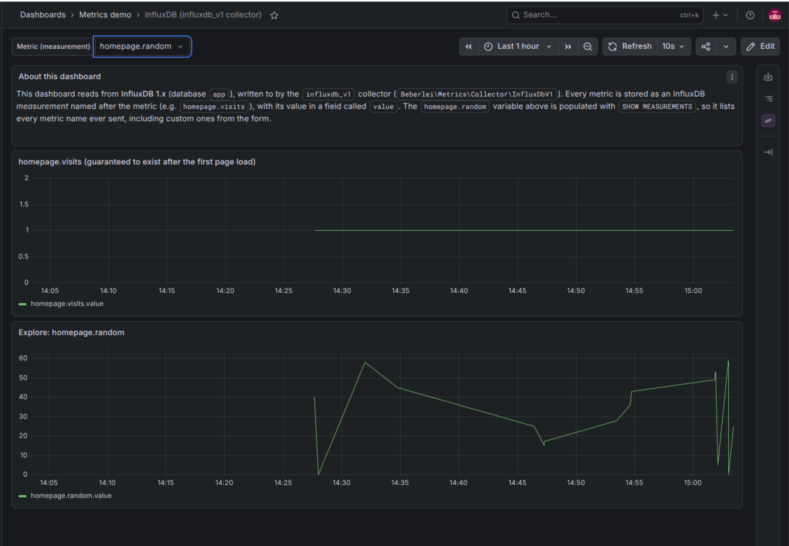

# Symfony demo application

This application use
[jolicode/docker-starter](https://github.com/jolicode/docker-starter) to provide
a local development environment.

## Running the application locally

### Requirements

A Docker environment is provided and requires you to have these tools available:

 * Docker
 * [Castor](https://github.com/jolicode/castor#installation)

#### Castor

Once castor is installed, in order to improve your usage of castor scripts, you
can install console autocompletion script.

If you are using bash:

```bash
castor completion | sudo tee /etc/bash_completion.d/castor
```

If you are using something else, please refer to your shell documentation. You
may need to use `castor completion > /to/somewhere`.

Castor supports completion for `bash`, `zsh` & `fish` shells.

### Docker environment

The Docker infrastructure provides a web stack with:
 - NGINX
 - PostgreSQL
 - PHP
 - Traefik
 - A container with some tooling:
   - Composer
   - Node
   - Yarn / NPM

...and, to back every collector demonstrated on the homepage (see
[Metrics dashboards](#metrics-dashboards) below):
 - Grafana
 - Graphite (with a bundled StatsD daemon)
 - InfluxDB (version 1)
 - InfluxDB (version 2)
 - LocalStack (emulating AWS CloudWatch, so no AWS account is needed)
 - Prometheus

### Domain configuration (first time only)

Before running the application for the first time, ensure your domain names
point the IP of your Docker daemon by editing your `/etc/hosts` file.

This IP is probably `127.0.0.1` unless you run Docker in a special VM (like docker-machine for example).

> [!NOTE]
> The router binds port 80 and 443, that's why it will work with `127.0.0.1`

```
echo '127.0.0.1 symfony-metrics.test grafana.symfony-metrics.test' | sudo tee -a /etc/hosts
```

### Starting the stack

Launch the stack by running this command:

```bash
castor start
```

> [!NOTE]
> the first start of the stack should take a few minutes.

The site is now accessible at the hostnames you have configured over HTTPS
(you may need to accept self-signed SSL certificate if you do not have mkcert
installed on your computer - see below).

### Metrics dashboards

Open the homepage: it automatically sends a few `homepage.*` metrics to
every collector configured in `config/packages/metrics.yaml`, and offers a
form to send arbitrary metrics to any collector on demand.

Grafana (`https://grafana.<your-domain>`) is fully provisioned out of the
box: a datasource and a ready-made dashboard exist for every collector
backed by an external database (PostgreSQL, Prometheus, Graphite/StatsD/
DogStatsD, InfluxDB v1, InfluxDB v2, CloudWatch). No manual setup is needed
— just load the homepage once, then open Grafana.

> [!TIP]
> Grafana only reliably picks up changes made under
> `infrastructure/docker/services/grafana/` (a datasource or a dashboard) on
> (re)start. If you edit one while the stack is already running, force a
> reload with `castor grafana`.

#### Screenshots

Homepage — configured collectors, auto-collected metrics, and the form to
send a custom metric to any of them:


A Grafana dashboard per backend:

<table>
  <tr>
    <td width="50%">
      <strong>PostgreSQL</strong> (<code>dbal</code>)<br>
      
    </td>
    <td width="50%">
      <strong>Prometheus</strong> (<code>prometheus</code>, <code>otel</code>)<br>
      
    </td>
  </tr>
  <tr>
    <td width="50%">
      <strong>Graphite</strong> (<code>graphite</code>, <code>statsd</code>, <code>dogstatsd</code>, <code>chain</code>)<br>
      
    </td>
    <td width="50%">
      <strong>InfluxDB</strong> (<code>influxdb_v1</code>)<br>
      
    </td>
  </tr>
</table>

> [!NOTE]
> Two more dashboards are provisioned but not screenshotted above: **InfluxDB
> v2** (`influxdb_v2` collector) and **AWS CloudWatch** (`cloudwatch`
> collector, backed by LocalStack). Load the homepage once and open Grafana
> to see them.

### SSL certificates

HTTPS is supported out of the box. SSL certificates are not versioned and will
be generated the first time you start the infrastructure (`castor start`) or if
you run `castor infra:generate-certificates`.

If you have `mkcert` installed on your computer, it will be used to generate
locally trusted certificates. See [`mkcert` documentation](https://github.com/FiloSottile/mkcert#installation)
to understand how to install it. Do not forget to install CA root from mkcert
by running `mkcert -install`.

If you don't have `mkcert`, then self-signed certificates will instead be
generated with openssl. You can configure [infrastructure/docker/services/router/openssl.cnf](infrastructure/docker/services/router/openssl.cnf)
to tweak certificates.

You can run `castor infra:generate-certificates --force` to recreate new certificates
if some were already generated. Remember to restart the infrastructure to make
use of the new certificates with `castor up` or `castor start`.

### Builder

Having some composer, yarn or other modifications to make on the project?
Start the builder which will give you access to a container with all these
tools available:

```bash
castor builder
```

### Other tasks

Checkout `castor` to have the list of available tasks.
